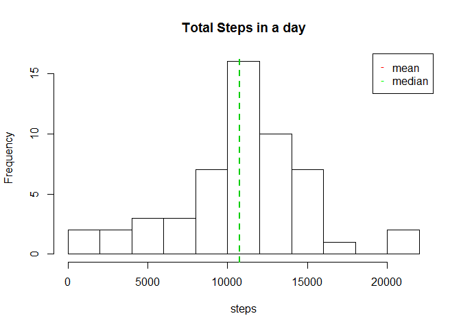
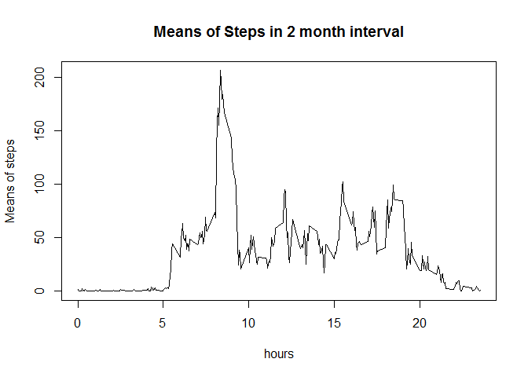
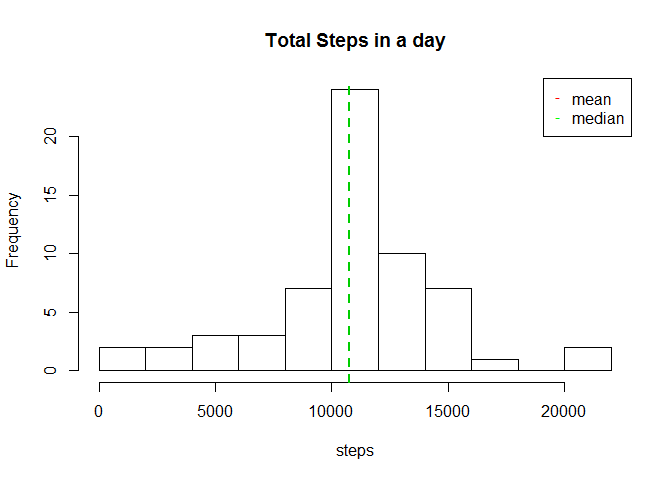
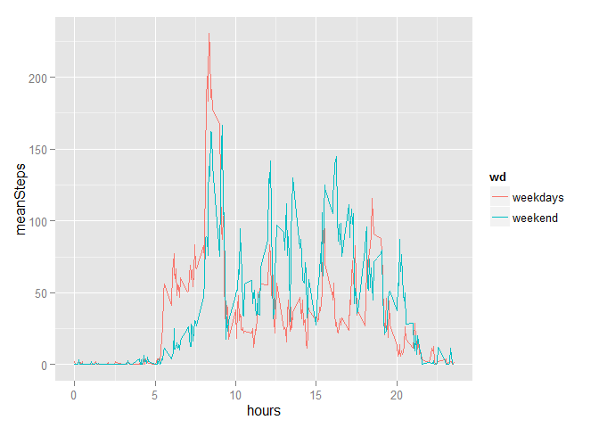

# Reproducible Research: Peer Assessment 1


## Loading and preprocessing the data


```r
library(ggplot2)
options(digits=12)
unzip("activity.zip")
myData<-read.csv("activity.csv", header = TRUE,colClasses = c("numeric","Date","numeric"))
head(myData)
```

```
##   steps       date interval
## 1    NA 2012-10-01        0
## 2    NA 2012-10-01        5
## 3    NA 2012-10-01       10
## 4    NA 2012-10-01       15
## 5    NA 2012-10-01       20
## 6    NA 2012-10-01       25
```

## What is mean total number of steps taken per day?

Summarize the steps by the date  
We exclude the values that are Not Available

```r
goodData<-complete.cases(myData$steps)
stepsPerDay<-aggregate(myData[goodData,]$steps, by=list(myData[goodData,]$date), FUN=sum,na.rm=TRUE)
```
Rename columns

```r
names(stepsPerDay) <- c("date", "sumSteps")
summary(stepsPerDay$sumSteps)
```

```
##       Min.    1st Qu.     Median       Mean    3rd Qu.       Max. 
##    41.0000  8841.0000 10765.0000 10766.1887 13294.0000 21194.0000
```

```r
hist(stepsPerDay$sumSteps,xlab="steps", main="Total Steps in a day",breaks=10)
meanStep<-mean(stepsPerDay$sumSteps)
abline(v = meanStep, lwd = 2, lty = 2,col=2)
medianStep<-median(stepsPerDay$sumSteps)
abline(v = medianStep, lwd = 2, lty = 2,col=3)
legend("topright", pch = "-", col = c("red", "green"), legend = c("mean", "median"))
```

 
  
Mean of the total steps

```r
meanStep
```

```
## [1] 10766.1886792
```
Median of the total steps

```r
medianStep
```

```
## [1] 10765
```
## What is the average daily activity pattern?


```r
stepsOnTime<-aggregate(myData[goodData,]$steps,by=list(myData[goodData,]$interval),FUN=mean,na.rm=TRUE)
names(stepsOnTime) <- c("interval", "meanSteps")
str(stepsOnTime)
```

```
## 'data.frame':	288 obs. of  2 variables:
##  $ interval : num  0 5 10 15 20 25 30 35 40 45 ...
##  $ meanSteps: num  1.717 0.3396 0.1321 0.1509 0.0755 ...
```

```r
with(stepsOnTime,plot(interval/100,meanSteps,type="l",xlab="hours",ylab="Means of steps",main="Means of Steps in 2 month interval"))
```

 
  
The most "stepping" interval

```r
maxInt<-(subset(stepsOnTime,stepsOnTime$meanSteps==max(stepsOnTime$meanSteps)))$interval
maxInt
```

```
## [1] 835
```
Interval in hours

```r
maxInt/100
```

```
## [1] 8.35
```
## Imputing missing values

Number of rows NA

```r
nrow(myData[!goodData,])
```

```
## [1] 2304
```
The strategy is to fill with the mean of the 5 minute interval, because is more probable  
We recall from the activity pattern what we calculate, stepsOnTime  
That is the mean of steps in the intervals of 5 minutes

```r
#stepsOnTime<-aggregate(myData$steps,by=list(myData$interval),FUN=mean,na.rm=TRUE)
#names(stepsOnTime) <- c("interval", "meanSteps")
```
We merge the NA data with the average data. The common field is "interval"

```r
replacedData<-merge(myData[!goodData,],stepsOnTime)
```
We replace the NA values

```r
replacedData$steps<-NULL
```
Renaming the columns and reaggarange for binding

```r
names(replacedData) <- c("interval", "date","steps")
replaced2<-replacedData[,c(3,2,1)]
```
Binding the good data and the replaced data

```r
myData2<-rbind(myData[goodData,],replaced2)
```
Now we recall the first diagram for the new dataset

```r
stepsPerDay2<-aggregate(myData2$steps, by=list(myData2$date), FUN=sum,na.rm=TRUE)
names(stepsPerDay2) <- c("date", "sumSteps")
summary(stepsPerDay2$sumSteps)
```

```
##       Min.    1st Qu.     Median       Mean    3rd Qu.       Max. 
##    41.0000  9819.0000 10766.1887 10766.1887 12811.0000 21194.0000
```

```r
hist(stepsPerDay2$sumSteps,xlab="steps", main="Total Steps in a day",breaks=10)
meanStep2<-mean(stepsPerDay2$sumSteps)
abline(v = meanStep2, lwd = 2, lty = 2,col=2)
medianStep2<-median(stepsPerDay2$sumSteps)
abline(v = medianStep2, lwd = 2, lty = 2,col=3)
legend("topright", pch = "-", col = c("red", "green"), legend = c("mean", "median"))
```

 

```r
meanStep2
```

```
## [1] 10766.1886792
```

```r
medianStep2
```

```
## [1] 10766.1886792
```

## Are there differences in activity patterns between weekdays and weekends?

Introduct a new column "wd" and fill with "weekdays"

```r
namevector <- c("wd")
myData2[,namevector] <- "weekdays"
```
Replace Saturdays and Sundays with "weekend"

```r
myData2[which(weekdays(as.Date(myData2$date,format="%Y-%m-%d"))=="Saturday", arr.ind=TRUE), 4] <- "weekend"
myData2[which(weekdays(as.Date(myData2$date,format="%Y-%m-%d"))=="Sunday", arr.ind=TRUE), 4] <- "weekend"
nrow(subset(myData2,wd=="weekend"))
```

```
## [1] 4608
```
Plotting

```r
stepsWeek<-aggregate(myData2$steps,by=list(myData2$interval,myData2$wd),FUN=mean,na.rm=TRUE)
names(stepsWeek) <- c("interval", "wd","meanSteps")
qplot(interval/100,meanSteps,data=stepsWeek,col=wd,geom="line",xlab="hours")
```

 

##Conclusions

In the weekend, one gets up later and valks fewer in the morning (not going to work), but over day, it walks more, than weekdays.
