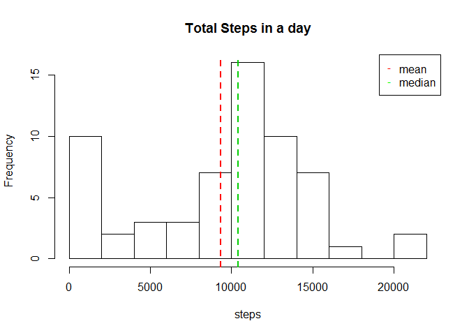

# Reproducible Research: Peer Assessment 1


## Loading and preprocessing the data


```r
unzip("activity.zip")
myData<-read.csv("activity.csv",header=TRUE)
head(myData)
```

```
##   steps       date interval
## 1    NA 2012-10-01        0
## 2    NA 2012-10-01        5
## 3    NA 2012-10-01       10
## 4    NA 2012-10-01       15
## 5    NA 2012-10-01       20
## 6    NA 2012-10-01       25
```

```r
tail(myData)
```

```
##       steps       date interval
## 17563    NA 2012-11-30     2330
## 17564    NA 2012-11-30     2335
## 17565    NA 2012-11-30     2340
## 17566    NA 2012-11-30     2345
## 17567    NA 2012-11-30     2350
## 17568    NA 2012-11-30     2355
```
We select the complete cases for further processing

```r
goodData<-complete.cases(myData$steps)
```

## What is mean total number of steps taken per day?

Summarize the steps by the date  
We exclude the values that are Not Available

```r
stepsPerDay<-aggregate(myData$steps, by=list(myData$date), FUN=sum,na.rm=TRUE)
```
Rename columns

```r
names(stepsPerDay) <- c("date", "sumSteps")
head(stepsPerDay)
```

```
##         date sumSteps
## 1 2012-10-01        0
## 2 2012-10-02      126
## 3 2012-10-03    11352
## 4 2012-10-04    12116
## 5 2012-10-05    13294
## 6 2012-10-06    15420
```

```r
hist(stepsPerDay$sumSteps,xlab="steps", main="Total Steps in a day",breaks=10)
meanStep<-mean(stepsPerDay$sumSteps)
abline(v = meanStep, lwd = 2, lty = 2,col=2)
medianStep<-median(stepsPerDay$sumSteps)
abline(v = medianStep, lwd = 2, lty = 2,col=3)
legend("topright", pch = "-", col = c("red", "green"), legend = c("mean", "median"))
```

 
  
Mean of the total steps

```r
meanStep
```

```
## [1] 9354.23
```
Median of the total steps

```r
medianStep
```

```
## [1] 10395
```
## What is the average daily activity pattern?


## Imputing missing values


## Are there differences in activity patterns between weekdays and weekends?
